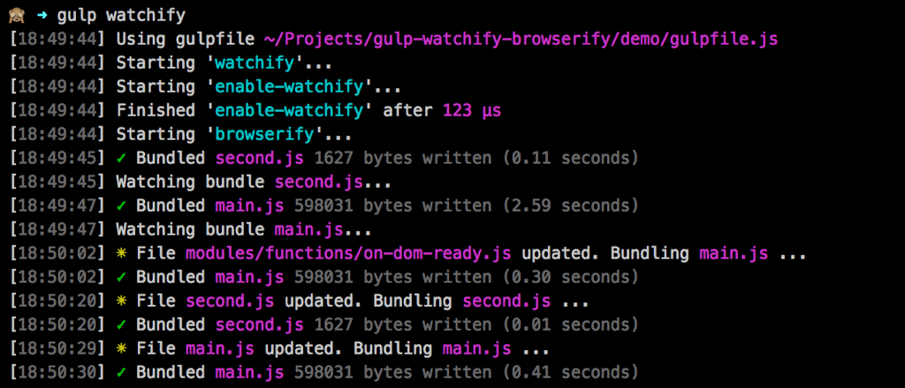

gulp-watchify-browserify
========================

> A *gulp* plugin for watching and bundling javascripts using *watchify* and *browserify*.

---

<!-- MarkdownTOC -->

- [About](#about)
  - ["Why a plugin?"](#why-a-plugin)
- [License](#license)

<!-- /MarkdownTOC -->

---

**README IN PROGRESS**

See [`./demo`](https://github.com/simbo/gulp-watchify-browserify/tree/master/demo) for example usage.

## About

**gulp-watchify-browserify** is a [gulp](http://gulpjs.com/) plugin for watching
and bundling javascripts using [watchify](https://github.com/substack/watchify)
and [browserify](https://github.com/substack/node-browserify).

Watchify offers a much more efficient and faster way of watching an rebundling
with browserify, than you could achieve with `gulp.watch()` or similar methods.

To work as expected, watchify/browserify has to do the file reading jobs and not
`gulp.src()`. That's why this plugin is not usable in a `.pipe()`. Instead, it
prepares the stream on demand and offers a callback function where you can pipe
to more gulp plugins and `gulp.dest()`. See [usage](#usage) for more details.

### "Why a plugin?"

> *"Can't you just use plain modules?"*

Sure, this can also be achieved without a plugin, by just using a bunch of node
modules in a custom gulp task – like you can replace every gulp plugin.
(There is also a 
[browserify recipe](https://github.com/gulpjs/gulp/blob/master/docs/recipes/fast-browserify-builds-with-watchify.md)
that does almost the same job like this plugin.)

But when you want to glob your browserify entries, log events and states to 
console, handle errors and make everything shiny, you propably come up with a
script of ~80 loc, which would be hard to reuse and maintain over multiple
projects (been there done that). So, imho, a plugin makes sense…

## License

[MIT &copy; 2016 Simon Lepel](http://simbo.mit-license.org/)
